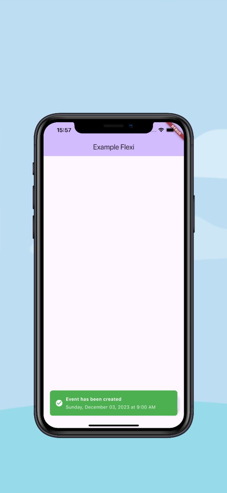
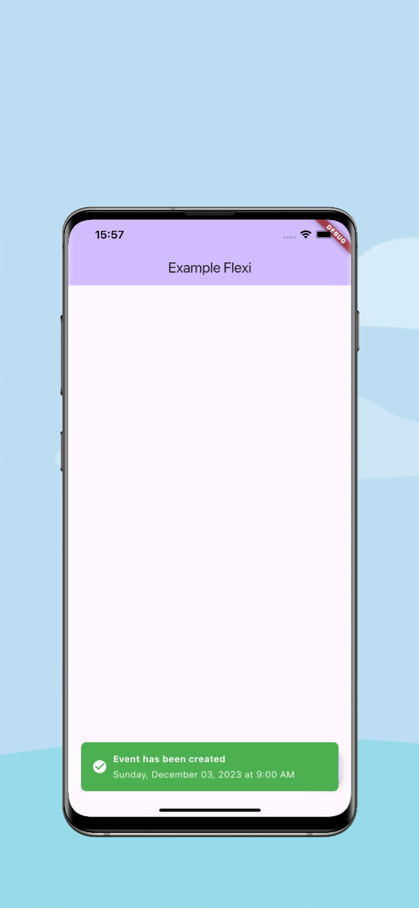

<!--
This README describes the package. If you publish this package to pub.dev,
this README's contents appear on the landing page for your package.

For information about how to write a good package README, see the guide for
[writing package pages](https://dart.dev/guides/libraries/writing-package-pages).

For general information about developing packages, see the Dart guide for
[creating packages](https://dart.dev/guides/libraries/create-library-packages)
and the Flutter guide for
[developing packages and plugins](https://flutter.dev/developing-packages).
-->

## Flexi Toast

Flexi Toast is a Flutter package designed to provide a customizable and flexible toast notification system. It allows you to show notifications at the top or bottom of the screen with various customizations like colors, icons, text styles, and durations. The toast can also handle user interactions through tap gestures.

## Created by [@badiniibrahim](https://github.com/badiniibrahim)

Liked some of my work? Buy me a coffee. Thanks for your support :heart:

<a href="https://buymeacoffee.com/toncopilote" target="_blank"></a>

## Screenshot

- IOS
  

- Android
  

## Features

- Customizable toast notifications that can appear at the top or bottom of the screen.
- Multiple toast types with different colors (success, info, warning, and danger).
- Customizable duration for toast visibility.
- Optional icons for each toast.
- Flexible text styles and border radius for rounded corners.-

## Getting Started

Add the dependency to your `pubspec.yaml` file:

```yaml
dependencies:
  ...
  flexi_toast: latest_version
```

## Here's a complete example showcasing the usage of the Flexi Toast:

```dart
import 'package:flexi_toast/toast_manager.dart';
import 'package:flexi_toast/toast_type.dart';
import 'package:flexi_toast/toast_position.dart';
import 'package:flutter/material.dart';

void main() {
  runApp(MyApp());
}

class MyApp extends StatelessWidget {
  @override
  Widget build(BuildContext context) {
    return MaterialApp(
      home: Scaffold(
        appBar: AppBar(
          title: Text('Flexi Toast Example'),
        ),
        body: Center(
          child: ElevatedButton(
            onPressed: () {
              ToastManager.show(
                context: context,
                message: "Success Toast",
                duration: Duration(seconds: 2),
                position: ToastPosition.bottom,
                type: ToastType.success,
                onTap: () {
                  print("Toast tapped!");
                },
              );
            },
            child: Text('Show Toast'),
          ),
        ),
      ),
    );
  }
}


```

### Parameters

- **`message`**: (required) - The main message to display in the toast.

- **`description`**: (optional) - A detailed description or additional information displayed under the message.

- **`duration`**: (optional) - Duration for how long the toast should remain visible. Default is 2 seconds.

- **`position`**: (optional) - The position of the toast (top or bottom). Default is ToastPosition.bottom.

- **`type`**: (optional) - The type of toast, determining its color and styling. Can be ToastType.danger,
  ToastType.warning, ToastType.success, or ToastType.info. Default is ToastType.info.

- **`textStyle`**: (optional) - A [TextStyle] for the toast message text. Default is white text on a dark background.

- **`borderRadius`**: (optional) - The border radius for the toast background. Default is Radius.circular(8).

- **`icon`**: (optional) - An optional widget to display as an icon in the toast.

## LinkedIn

Connect with me on [LinkedIn](https://www.linkedin.com/in/badini-ibrahim-sawadogo-306b119b/)
